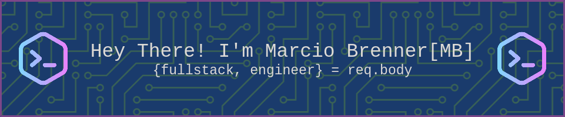

<!--   -->


<!-- 
gerador de banner
https://leviarista.github.io/github-profile-header-generator/ 
-->
<div>
  
  
  [](https://git.io/typing-svg)
  
<!-- texto em azul   -->
<!--   [](https://git.io/typing-svg) -->
  
<!--    -->
<!--   editor usado para fazer o  typing 
https://readme-typing-svg.herokuapp.com/demo/
-->

</div>  


- *Fullstack Development Student at* [Trybe](https://www.betrybe.com);
- *Analysis and systems development at* [Universidade Estácio](https://estacio.br/cursos/graduacao/analise-e-desenvolvimento-de-sistemas);


<div align="center">

  [](https://spotify-github-profile.vercel.app/api/view?uid=mzw7qqi1vp24n4q1502af8xzg&redirect=true)

  </div>


##


<div align="center">
  
## Technologies and tools:
  
  <div align="center"style="display: inline_block"><br>
  
  
  
  
  
  
  
  
  
  
 
  
 
 
 
 
 
</div> 

</div>


<br>
<br>
<details>

<summary>🌱 Learning:</summary>

<div>
  
- [x] Git & GitHub;   
- [x] HTML5;
- [x] CSS3;
- [x] Javascript;
- [x] Type Script;
- [x] ReactJS;
- [X] Redux;
- [X] Docker;
- [X] Node.js;
- [X] Sequelize; 
- [X] Express;  
- [X] SQL;
- [X] MySql;  
- [X] SASS;
- [X] Styled Component;
- [x] OutSystems (enthusiastic 😆);
- [ ] MongoDB
- [ ] Python
- [ ] Algorithms and Data Structure
- [ ] Next.js
- [ ] React Native
- [ ] Flutter
  
</div>
  
</details>  

  
:school_satchel: **Main Tools:** VSCode, Git, GitHub, Discord, Slack;

##
<h2 align="center">Minhas atividades</h2>

<div align="center">
 <a href="https://wakatime.com/@mbrennerr">
  
 </a>
</div>

<div align="center">
  <a href="https://github.com/mbrennerr">
  
  
</div>

  ##
  
<details> 
 
  <summary> MyDevMetrics </summary>
 
  
     <!--START_SECTION:waka-->


**🐱 My GitHub Data** 

> 🏆 319 Contributions in the Year 2022
 > 
> 📦 291.9 kB Used in GitHub's Storage 
 > 
> 🚫 Not Opted to Hire
 > 
> 📜 36 Public Repositories 
 > 
> 🔑 0 Private Repositories  
 > 
**I'm a Night 🦉** 

```text
🌞 Morning    39 commits     ██░░░░░░░░░░░░░░░░░░░░░░░   8.33% 
🌆 Daytime    169 commits    █████████░░░░░░░░░░░░░░░░   36.11% 
🌃 Evening    226 commits    ████████████░░░░░░░░░░░░░   48.29% 
🌙 Night      34 commits     █░░░░░░░░░░░░░░░░░░░░░░░░   7.26%

```
📅 **I'm Most Productive on Friday** 

```text
Monday       49 commits     ██░░░░░░░░░░░░░░░░░░░░░░░   10.47% 
Tuesday      87 commits     ████░░░░░░░░░░░░░░░░░░░░░   18.59% 
Wednesday    64 commits     ███░░░░░░░░░░░░░░░░░░░░░░   13.68% 
Thursday     59 commits     ███░░░░░░░░░░░░░░░░░░░░░░   12.61% 
Friday       89 commits     ████░░░░░░░░░░░░░░░░░░░░░   19.02% 
Saturday     41 commits     ██░░░░░░░░░░░░░░░░░░░░░░░   8.76% 
Sunday       79 commits     ████░░░░░░░░░░░░░░░░░░░░░   16.88%

```


📊 **This Week I Spent My Time On** 

```text
⌚︎ Time Zone: America/Manaus

💬 Programming Languages: 
Python                   7 hrs 5 mins        █████████████████████░░░░   84.17% 
Bash                     18 mins             █░░░░░░░░░░░░░░░░░░░░░░░░   3.67% 
Docker                   17 mins             █░░░░░░░░░░░░░░░░░░░░░░░░   3.55% 
JSON                     13 mins             ░░░░░░░░░░░░░░░░░░░░░░░░░   2.62% 
XML                      11 mins             ░░░░░░░░░░░░░░░░░░░░░░░░░   2.32%

🔥 Editors: 
VS Code                  8 hrs 25 mins       █████████████████████████   100.0%

🐱‍💻 Projects: 
sd-015-b-project-job-insi5 hrs 26 mins       ████████████████░░░░░░░░░   64.58% 
sd-015-b-live-lectures   1 hr 52 mins        █████░░░░░░░░░░░░░░░░░░░░   22.28% 
sd-015-b-project-car-shop42 mins             ██░░░░░░░░░░░░░░░░░░░░░░░   8.32% 
EXERCISES                24 mins             █░░░░░░░░░░░░░░░░░░░░░░░░   4.82%

💻 Operating System: 
Linux                    8 hrs 25 mins       █████████████████████████   100.0%

```

**I Mostly Code in JavaScript** 

```text
JavaScript               18 repos            ██████████████████░░░░░░░   72.0% 
TypeScript               5 repos             █████░░░░░░░░░░░░░░░░░░░░   20.0% 
HTML                     2 repos             ██░░░░░░░░░░░░░░░░░░░░░░░   8.0%

```


**Timeline**

 


 Last Updated on 08/07/2022 18:51:49 UTC
<!--END_SECTION:waka-->

</details>  


  
  ##
 <div align="center">
   <a href = "mailto:marciobrennerbusiness@gmail.com">
     
   </a>
   <a href="https://www.linkedin.com/in/mbrennerr" target="_blank">
      
   </a> 
   <a href="https://mbrennerr.vercel.app/">
    
   </a>
 </div>
    
  ##
   
    
   

   
  


<!--
**mbrennerr/mbrennerr** is a ✨ _special_ ✨ repository because its `README.md` (this file) appears on your GitHub profile.

Here are some ideas to get you started:

- 🔭 I’m currently working on ...
- 🌱 I’m currently learning ...
- 👯 I’m looking to collaborate on ...
- 🤔 I’m looking for help with ...
- 💬 Ask me about ...
- 📫 How to reach me: ...
- 😄 Pronouns: ...
- ⚡ Fun fact: ...
-->
